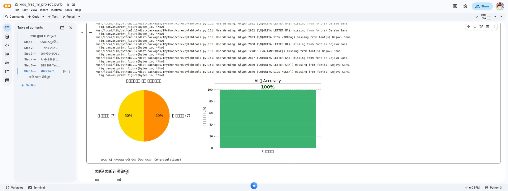

# 🕵️🥭🍊 ମୋର ପ୍ରଥମ AI Project — ଫଳ ଗୋଇନ୍ଦା!
### My First AI Project — The Fruit Detective!

**ଓଡ଼ିଆ ଭାଷାରେ** ଲେଖା ହୋଇଥିବା ଏକ beginner-friendly Machine Learning project — ପିଲାମାନଙ୍କୁ AI ଶିଖାଇବା ପାଇଁ। ଆମ୍ବ ଓ କମଳା ଚିହ୍ନଟ କରି AI ଶିଖ!



---

## 📋 ବିଷୟସୂଚୀ (Table of Contents)

1. [ସାମଗ୍ରିକ ଚିତ୍ର — Notebook କ'ଣ କରୁଛି?](#-ସାମଗ୍ରିକ-ଚିତ୍ର)
2. [Step 1 — Libraries ଆଣ](#-step-1--libraries-ଆଣ)
3. [Step 2 — Dataset ତିଆର](#-step-2--dataset-ତିଆର)
4. [Step 3 — ଡାଟା ଚିତ୍ର ଦେଖ EDA](#-step-3--ଡାଟା-ଚିତ୍ର-ଦେଖ-eda)
5. [Step 4 — AI ଶିଖାଅ Training](#-step-4--ai-ଶିଖାଅ-training)
6. [Step 5 — ନୂଆ ଫଳ Test](#-step-5--ନୂଆ-ଫଳ-test)
7. [Step 6 — Victory Charts](#-step-6--victory-charts)
8. [ଡାଟା ର ଯାତ୍ରା — End-to-End Flow](#-ଡାଟା-ର-ଯାତ୍ରା--end-to-end-flow)
9. [୧୦୦% Accuracy କାହିଁକି?](#-୧୦୦-accuracy-କାହିଁକି)
10. [ଚେଷ୍ଟା କର — Experiments](#-ଚେଷ୍ଟା-କର--experiments)
11. [ML ଶବ୍ଦ ଭଣ୍ଡାର](#-ml-ଶବ୍ଦ-ଭଣ୍ଡାର)
12. [Notebook ଚଲାଅ — How to Run](#-notebook-ଚଲାଅ--how-to-run)
13. [Files ସୂଚୀ](#-files-ସୂଚୀ)

---

## 🔭 ସାମଗ୍ରିକ ଚିତ୍ର

ଏହି Notebook ଏକ **binary classification problem** solve କରୁଛି:
ଫଳ ର ଓଜନ ଓ ରଙ୍ଗ ଦେଖି — ଏହା **ଆମ୍ବ** ନା **କମଳା** ଠିକ କରିବ।

```
Input (ଯାହା ଦେଉ)     →   ML Model     →   Output (ଉତ୍ତର)
[ଓଜନ, ରଙ୍ଗ]              Decision          "ଆମ୍ବ" ବା
                           Tree              "କମଳା"
```

**Machine Learning pipeline (ଧାଡ଼ି):**
```
ଡାଟା ସଂଗ୍ରହ → ଚିତ୍ର ଦେଖ → Model ଶିଖାଅ → ଯାଞ୍ଚ କର → ନୂଆ ଫଳ Test
```

> 🤖 **Robot:** "ଗୋଟିଏ ଫଳ ଦୋକାନୀ ଚଷ୍ମା ହଜେଇ ଦେଇଛି। ସେ ଫଳ ଚିହ୍ନଟ କରିପାରୁ ନାହିଁ! ମୁଁ help କରିବି! 🕵️"

ଏହି Notebook — **ଗୋଟିଏ Jupyter file** — internet ନ ଲାଗେ, GPU ନ ଲାଗେ, Google Colab ରେ free ରେ ଚଳେ।

---

## 📦 Step 1 — Libraries ଆଣ

> 🤖 **Robot:** "ଖେଳ ଆଗରୁ toys ବାହାର କର — coding ଆଗରୁ tools ଆଣ! 🧰"
> *(cricket bat ଛଡ଼ା cricket ହୁଏ ନାହିଁ!)*

### Code:
```python
import numpy as np
import matplotlib.pyplot as plt
from sklearn.tree import DecisionTreeClassifier
from sklearn.metrics import accuracy_score
```

### ପ୍ରତ୍ୟେକ line ର ଅର୍ଥ:

| Library | କ'ଣ କରେ | ଓଡ଼ିଆ ଅର୍ଥ |
|---------|---------|-----------|
| `numpy` | ଦ୍ରୁତ ଗଣିତ — numbers ର list (array) | Calculator ଭଳି 🔢 |
| `matplotlib.pyplot` | Chart ଓ Graph ଆଁକେ | ଚିତ୍ରକର ଭଳି 🎨 |
| `DecisionTreeClassifier` | AI ର brain — data ଦେଖି ଶିଖେ | AI ର ମୁଣ୍ଡ 🧠 |
| `accuracy_score` | Model କେତେ ଠିକ ଦେଖେ | Marks ଦେଉଥିବା ଶିକ୍ଷକ 📝 |

**`import numpy as np`** — `as np` ହେଉଛି shortcut। `numpy.array()` ଲେଖିବା ବଦଳରେ `np.array()` ଲେଖ — ସମୟ ବଞ୍ଚେ!

**`from sklearn.tree import DecisionTreeClassifier`** — sklearn ର `tree` section ରୁ ଆମ AI brain ଆଣୁଛୁ। Decision Tree ଏହିଭଳି ଭାବି — *"ଓଜନ > 120g? ହଁ → କମଳା। ନା → ଆମ୍ବ।"*

### Output:
```
========================================
🤖 Robot: 'ସବୁ tools ଆସିଗଲା!'
🎒 Backpack ଭର୍ତ୍ତି! Mission start! 🚀
========================================
✅ numpy    — calculator ଭଳି (ଗଣିତ ପାଇଁ)
✅ matplotlib — ଚିତ୍ରକର ଭଳି (chart ଆଁକିବ)
✅ sklearn  — AI ର super brain! 🧠
🎉 READY TO ROLL!
```

---

## 🥭🍊 Step 2 — Dataset ତିଆର

> 🕵️ **Detective Robot:** "ଫଳ ଚିହ୍ନଟ ପାଇଁ ଦୁଇଟି clue ଯଥେଷ୍ଟ!"

**Clue 1 🔍:** ଆମ୍ବ ହାଲୁକା (80–110g), କମଳା ଭାରୀ (130–200g)
**Clue 2 🎨:** ଆମ୍ବ ହଳଦିଆ (color=0), କମଳା ଲାଲ ରଙ୍ଗ (color=1)

### Dataset:
| ଫଳ | Samples | ଓଜନ | ରଙ୍ଗ code |
|-----|---------|-----|----------|
| 🥭 ଆମ୍ବ | 7 ଟି | 80–110g | 0 (ହଳଦିଆ) |
| 🍊 କମଳା | 7 ଟି | 130–200g | 1 (କମଳା) |

### Code ର ଅର୍ଥ:

```python
fruits_data = [
    [150, 1],  # 🍊 କମଳା — "ମୁଁ ଭାରୀ ଓ ଗୋଲ!"
    [170, 1],  # 🍊 କମଳା — "Gym ଯାଏ 💪"
    ...
    [90,  0],  # 🥭 ଆମ୍ବ — "ଆମ୍ବ ରାଜା! 👑"
    [100, 0],  # 🥭 ଆମ୍ବ — "Alphonso ବଂଶ 😌"
]
```
- ଏହା **Python list of lists** — ପ୍ରତ୍ୟେକ ଛୋଟ list `[ଓଜନ, ରଙ୍ଗ]` ଗୋଟିଏ ଫଳ।
- ଆମ ପାଖରେ **14 ଟି ଫଳ** — 7 ଆମ୍ବ + 7 କମଳା।
- ଆମ୍ବ (80–110g) ଓ କମଳା (130–200g) ମଧ୍ୟରେ **20g gap** ଅଛି — ଏଣୁ AI ସହଜରେ ଶିଖେ।

```python
labels = [1, 1, 1, 1, 1, 1, 1,   # ← 7 ଟି କମଳା
          0, 0, 0, 0, 0, 0, 0]   # ← 7 ଟି ଆମ୍ବ
```
- ଏହା **ଉତ୍ତର list** — `fruits_data` ର ପ୍ରତ୍ୟେକ ଫଳ ର ଠିକ ଉତ୍ତର।
- Position 0 (`[150,1]`) → label 0 (`1`) → କମଳା।
- **ଦୁଇ list ର ଧାଡ଼ି ସମାନ ହେବା ଦରକାର** — ନ ହେଲେ AI ଭୁଲ ଶିଖିବ!

```python
X = np.array(fruits_data)   # shape: (14, 2)
y = np.array(labels)        # shape: (14,)
```
- ML ରେ `X` = **features (input)**, `y` = **labels (ଉତ୍ତର)** — ଏହା worldwide convention।
- `X` ର shape `(14, 2)` — 14 ଫଳ, 2 ଟି feature ପ୍ରତ୍ୟେକ।

```python
print(f"🥭 Team Mango: {sum(y==0)} ଟି")
```
- `y==0` — boolean array (`True/False`)। `sum()` — True ଗଣେ → ଆମ୍ବ count।
- `f"..."` — **f-string**: `{}` ଭିତରେ Python expression ସିଧା ଲେଖ।

### Output:
```
🗂️  EVIDENCE COLLECTED!
======================================
🥭 Team Mango  (ଆମ୍ବ team) : 7 ଟି
🍊 Team Orange (କମଳା team): 7 ଟି
📦 ମୋଟ suspects           : 14 ଟି
======================================
```

---

## 📊 Step 3 — ଡାଟା ଚିତ୍ର ଦେଖ (EDA)

**EDA = Exploratory Data Analysis** — training ଆଗରୁ ଡାଟା ଦେଖ, pattern ଖୋଜ।

> 💡 ଯଦି chart ରେ ଦୁଇ ଗ୍ରୁପ ଅଲଗା ଦେଖାଉଛି — AI ସହଜରେ ଶିଖିବ। ଯଦି ମିଶି ଅଛି — accuracy କମ ହୁଏ।

### Code ର ଅର୍ଥ:

```python
plt.figure(figsize=(9, 5))
```
- ଖାଲି canvas ତିଆର — 9 inch ଚଉଡ଼ା, 5 inch ଉଚ୍ଚ।

```python
mango_weights = [X[i][0] for i in range(len(y)) if y[i] == 0]
```
- **List comprehension** — compact loop। ଆମ୍ବ ର ଓଜନ ଗୁଡ଼ିକ ଅଲଗା list ରେ ଆଣ।
- `X[i][0]` = i-ତମ ଫଳ ର ଓଜନ (column 0)।

```python
plt.scatter(..., color='gold', s=300, zorder=3, edgecolors='darkorange')
```
- `scatter()` = dots chart। `s=300` = dot ର ଆକାର। `zorder=3` = grid ଉପରେ dots ଦେଖାଇବ।

```python
plt.axhline(y=120, color='red', linestyle='--', alpha=0.5)
```
- 120g ରେ ଏକ dashed line — **ଦୁଇ ଗ୍ରୁପ ର boundary**। Decision Tree ଏଠି split ନେବ।
- `alpha=0.5` = 50% transparent — line ଟି dots ଙ୍କୁ ଲୁଚାଉ ନ ଥାଏ।

### ଦେଖ:
- 🟡 ହଳଦିଆ dots **120g ତଳେ** → 7 ଟି ଆମ୍ବ
- 🟠 କମଳା dots **120g ଉପରେ** → 7 ଟି କମଳା
- ଦୁଇ ଗ୍ରୁପ **ସ୍ପଷ୍ଟ ଅଲଗା** — ଏହାକୁ *linearly separable* କୁହାଯାଏ।

---

## 🧠 Step 4 — AI ଶିଖାଅ (Training)

> 🤖 **Robot:** "ତୁ ଖାଇ ଖାଇ ଶିଖ (experience)। ମୁଁ data ଦେଖି ଶିଖ (training)! ତୁ 10 ବର୍ଷ ଶିଖୁଛୁ... ମୁଁ 0.001 second ରେ! 😏"

### Code ର ଅର୍ଥ:

```python
model = DecisionTreeClassifier(random_state=42)
```
- **Model object** ତିଆର — ଏବେ ଏଇଟି blank brain।
- `random_state=42` = **random seed** — ପ୍ରତ୍ୟେକ ଥର code ଚଲାଇଲେ ଏକ ଫଳ ମିଳିବ। 42 ଏକ popular choice (pop culture reference — *Hitchhiker's Guide to the Galaxy*)।
- Decision Tree ଏହିଭଳି ଭାବେ:
```
ଓଜନ > 120g?
├── ହଁ → 🍊 କମଳା
└── ନା → 🥭 ଆମ୍ବ
```

```python
model.fit(X, y)
```
- **ଏହା ସବୁଠୁ ଗୁରୁତ୍ୱପୂର୍ଣ୍ଣ line।**
- `.fit()` = **training**। 14 ଫଳ ଓ ଉତ୍ତର ଦେଖି AI pattern ଶିଖେ।
- ଭିତରେ ଭିତରେ: "ଓଜନ > 80? ଓଜନ > 85? ... ଓଜନ > 120?" — ସବୁ try କରି best split ବାଛେ।
- Modern computer ରେ **1 millisecond** ରୁ କମ ସମୟ ଲାଗେ!

```python
predictions = model.predict(X)
accuracy    = accuracy_score(y, predictions) * 100
```
- `.predict(X)` = model ତାର ଶିଖିଥିବା ଜ୍ଞାନ ବ୍ୟବହାର କରି ଉତ୍ତର ଦିଏ।
- `accuracy_score(y, predictions)` = ଠିକ ଉତ୍ତର ÷ ମୋଟ × 100 = **14/14 × 100 = 100%**
- `{accuracy:.0f}` — f-string ରେ `.0f` = 0 decimal place (100.0 → 100)।

### Output:
```
🎓 TRAINING REPORT CARD
===================================
📝 AI ର Marks   : 100% 📊
📚 Questions    : 14 ଟି ଫଳ
✅ Correct      : 14 ଟି
===================================
🎉 ୧୦୦%!! AI ଟି TOPPER!!
🤖 Robot: 'ଶିକ୍ଷକ ମୋତେ Gold Medal ଦିଅ! 🥇'
🏫 School: 'ତୁ Robot... Medal ନ ମିଳିବ 😤'
🤖 Robot: '...okay fine 😞'
```

---

## 🔍 Step 5 — ନୂଆ ଫଳ Test

> 🕵️ **Detective Robot:** "Mystery fruits ଆସୁଛନ୍ତି! ସେମାନେ mask ପିନ୍ଧିଛନ୍ତି... କିନ୍ତୁ ଓଜନ ଲୁଚାଇ ପାରିବ ନାହାଁନ୍ତି! 😏"

### Code ର ଅର୍ଥ:

```python
new_fruits = [
    [155, 1],   # Mystery Fruit A — ଭାରୀ + କମଳା ରଙ୍ଗ
    [ 92, 0],   # Mystery Fruit B — ହାଲୁକା + ହଳଦିଆ
    [175, 1],   # Mystery Fruit C — ଅତ୍ୟଧିକ ଭାରୀ
    [ 88, 0],   # Mystery Fruit D — ଛୋଟ + ହଳଦିଆ
]
```
- ଏହି 4 ଟି ଫଳ model ଆଗରୁ **ଦେଖି ନ ଥିଲା** — ଏହା real-world test।

```python
label_map = {0: '🥭 ଆମ୍ବ (MANGO!)', 1: '🍊 କମଳା (ORANGE!)'}
```
- Python **dictionary** — 0/1 ସଂଖ୍ୟାକୁ readable name ରେ convert କରେ।

```python
results = model.predict(np.array(new_fruits))
```
- Decision Tree ଭିତରେ ପ୍ରଶ୍ନ ପଚାରେ: *"ଓଜନ > 120?"*
  - A (155g) → ହଁ → 🍊 ✅
  - B (92g)  → ନା → 🥭 ✅
  - C (175g) → ହଁ → 🍊 ✅
  - D (88g)  → ନା → 🥭 ✅

```python
for i, (fruit, result) in enumerate(zip(new_fruits, results)):
    color_name = 'ହଳଦିଆ' if fruit[1] == 0 else 'କମଳା'
    print(f"{fruit_emojis[i]} Fruit {fruit_names[i]}: {fruit[0]}g {color_name:>6} → {label_map[result]}")
```
- `zip()` = ଦୁଇ list ଏକ ସାଥରେ loop।
- `enumerate()` = index `i` ମଧ୍ୟ ଦିଏ।
- `{color_name:>6}` = 6 character ରେ right-align (neat column ପାଇଁ)।

### Output:
```
🔍 DETECTIVE REPORT — MYSTERY FRUITS EXPOSED! 🎉
================================================
🎭 Fruit A:  155g  କମଳା  →  🍊 କମଳା (ORANGE!)
🥸 Fruit B:   92g  ହଳଦିଆ →  🥭 ଆମ୍ବ (MANGO!)
🤔 Fruit C:  175g  କମଳା  →  🍊 କମଳା (ORANGE!)
😶 Fruit D:   88g  ହଳଦିଆ →  🥭 ଆମ୍ବ (MANGO!)
================================================
🤖 Robot: 'ମୁଁ ସବୁ ଚିହ୍ନଟ କଲି! ଆଇସ୍ ଖିଆ ମିଳିବ? 🍦'
```

---

## 🏆 Step 6 — Victory Charts

> 🤖 **Robot:** "୧୦୦% ପାଇଲି! Chart ଦେଖ! ଦେଖ! 👀 *(Robot dance କରୁଛି... robots dance କରନ୍ତି?)*"

### Code ର ଅର୍ଥ:

```python
fig, axes = plt.subplots(1, 2, figsize=(13, 5))
```
- **2 ଟି chart side by side** — `axes[0]` = ବାମ, `axes[1]` = ଡାହାଣ।

**Chart 1 — Pie Chart:**
```python
axes[0].pie([7, 7], autopct='%1.0f%%', explode=(0.05, 0.05), shadow=True)
```
- `[7, 7]` = ସମ ଭାଗ (50-50)। `autopct` = % label auto। `explode` = slice ଟିକେ ବାହାରି ଆସ (dramatic!)। `shadow=True` = 3D ଛାୟା।

**Chart 2 — Bar Chart:**
```python
axes[1].set_ylim(0, 115)
axes[1].text(0, accuracy + 3, f'{accuracy:.0f}% 🥳', ha='center', fontsize=18)
axes[1].axhline(y=100, color='gray', linestyle='--')
```
- `ylim(0, 115)` = y-axis 115 ପର୍ଯ୍ୟନ୍ତ — `100% 🥳` text ର ଜାଗା ପାଇଁ।
- `axhline(y=100)` = perfect score ର dashed reference line।

### Output:
- 🥧 50/50 pie chart — ଦୁଇ team ସମ ସମ
- 📊 100% ଲেখা ସবুজ bar — AI ର report card!

---

## 🔄 ଡାଟା ର ଯାତ୍ରା — End-to-End Flow

```
Step 2: Python list ତିଆର
fruits_data = [[150,1],[170,1],...,[90,0],[80,0],...]
labels      = [1,1,1,1,1,1,1,0,0,0,0,0,0,0]
        ↓
np.array() — numpy array ରେ convert
X.shape = (14, 2)   ← 14 ଫଳ, 2 feature
y.shape = (14,)     ← 14 ଉତ୍ତର
        ↓
Step 3: EDA — X[i][0] → ଓଜନ → scatter plot dots
        ↓
Step 4: Training
model.fit(X, y)
→ Decision Tree ଶିଖିଲା: "ଓଜନ > 120 → କମଳା, ନ ହେଲେ → ଆମ୍ବ"
        ↓
Step 4: Self-test
model.predict(X) → [1,1,1,1,1,1,1,0,0,0,0,0,0,0]
accuracy_score   → 14/14 = 100%
        ↓
Step 5: ନୂଆ ଫଳ predict
new_fruits = [[155,1],[92,0],[175,1],[88,0]]
model.predict() → [1, 0, 1, 0]
→ କମଳା, ଆମ୍ବ, କମଳା, ଆମ୍ବ
        ↓
Step 6: Charts — Pie + Bar
```

---

## 💯 ୧୦୦% Accuracy କାହିଁକି?

> ⚠️ ଆସଲ ML project ରେ ୧୦୦% **normal ନୁହେଁ!** ଏଠି 3 ଟି କାରଣ ଅଛି:

**କାରଣ 1 — ଡାଟା ଗୁଡ଼ିକ ସ୍ପଷ୍ଟ ଅଲଗା:**
ଆମ୍ବ (80–110g) ଓ କମଳା (130–200g) ମଧ୍ୟରେ 20g gap। Decision Tree ଗୋଟିଏ ପ୍ରଶ୍ନ ରେ ସବୁ ଠିକ କରିଦିଏ।

**କାରଣ 2 — Training data ଉପରେ test:**
`model.predict(X)` — ଯାହା ଦେଖି ଶିଖିଲା ସେଥି ଉପରେ test। ଠିକ ଯେମିତି ଛାତ୍ର ଆଗୁଆ ଉତ୍ତର ଜାଣି exam ଦେଲା! ଆସଲ ML ରେ **train/test split** ଦରକାର:
```python
from sklearn.model_selection import train_test_split
X_train, X_test, y_train, y_test = train_test_split(X, y, test_size=0.2)
model.fit(X_train, y_train)
accuracy = accuracy_score(y_test, model.predict(X_test))
```

**କାରଣ 3 — Dataset ଅତ୍ୟଧିକ ଛୋଟ:**
14 samples — ଆସଲ project ରେ ହଜାର ହଜାର।

**Overfitting କ'ଣ?**
ଯଦି ଆମ୍ବ ଓ କମଳା ର ଓଜନ overlap ହୁଅନ୍ତା (ଯେମ. ଆମ୍ବ 145g), model training data **rote learn** କରନ୍ତା — ନୂଆ ଫଳ ରେ fail। ଏହାକୁ **overfitting** (Robot rote-learn 😂) କୁହାଯାଏ।

---

## 🧪 ଚେଷ୍ଟା କର — Experiments

### Experiment 1 — ଗୋଳମାଳ ଫଳ ଯୋଡ଼
```python
# 145g ଆମ୍ବ — কমলার range ରେ overlap!
fruits_data.append([145, 0])
labels.append(0)
```
→ Accuracy 100% ରୁ ତଳକୁ ଖସିବ — AI confuse ହୁଏ ଦେଖ!

### Experiment 2 — ରଙ୍ଗ ବାଦ ଦିଅ
```python
X_weight_only = X[:, 0:1]   # ଶୁଧୁ ଓଜନ
model.fit(X_weight_only, y)
```
→ ଏହି dataset ରେ ଓଜନ ଏକୁଟିଆ ଯଥେଷ୍ଟ। Accuracy ତଥାପି 100% — ରଙ୍ଗ redundant!

### Experiment 3 — 3ୟ ଫଳ ଯୋଡ଼ (Multi-class)
```python
# ଅଙ୍ଗୁର — ଅତ୍ୟଧିକ ହାଲୁକା, 20–40g, color=2
fruits_data += [[25,2],[30,2],[35,2]]
labels      += [2, 2, 2]
```
→ **3-class classification!** Decision Tree ଆପେ handle କରେ।

### Experiment 4 — ଅଲଗା Algorithm
```python
from sklearn.neighbors import KNeighborsClassifier
model = KNeighborsClassifier(n_neighbors=3)
model.fit(X, y)
```
→ Decision Tree ସହ compare କର। ଦୁଇଟି ଏଠି 100% ଦେବ।

### Experiment 5 — Train/Test Split (ଆସଲ ପଦ୍ଧତି)
```python
from sklearn.model_selection import train_test_split
X_train, X_test, y_train, y_test = train_test_split(X, y, test_size=0.3, random_state=42)
model.fit(X_train, y_train)
print(f"Test accuracy: {accuracy_score(y_test, model.predict(X_test))*100:.0f}%")
```
→ Model ନ ଦେଖିଥିବା data ରେ test — ଆସଲ evaluation!

---

## 📚 ML ଶବ୍ଦ ଭଣ୍ଡାର

| ML ଶବ୍ଦ | ଅର୍ଥ | ମଜାଳିଆ ଉଦାହରଣ 😂 |
|---------|------|-----------------|
| **Dataset** | ଶିଖିବା ପାଇଁ ଡାଟା | AI ର Tiffin box 🍱 |
| **Feature** | Input ର ଗୁଣ (ଓଜନ, ରଙ୍ଗ) | ଫଳ ର ପରିଚୟ card |
| **Label** | ଠିକ ଉତ୍ତର (0 ବା 1) | ପ୍ରଶ୍ନ ପତ୍ର ର answer key |
| **Training** | AI କୁ ଡାଟା ଦେଖାଇ ଶିଖାଇବା | Robot School 🏫 |
| **Model** | Trained AI (Decision Tree) | Robot ର ମୁଣ୍ଡ 🤖 |
| **Prediction** | Model ର ଉତ୍ତର | Robot ର guess 🎯 |
| **Accuracy** | ଠିକ ଉତ୍ତର ର % | Report Card 📝 |
| **Overfitting** | Rote learn — ଆସଲ ଶିଖା ନାହିଁ | Robot ମୁଣ୍ଡ ପକ 😂 |
| **EDA** | Training ଆଗରୁ data ଚିତ୍ର ଦେଖ | ଖେଳ ଆଗରୁ field ଦେଖ |

---

## 🚀 Notebook ଚଲାଅ — How to Run

**Option 1 — Google Colab (ସବୁଠୁ ସହଜ):**
1. `kids_first_ml_project.ipynb` → Google Drive upload
2. Colaboratory ରେ open
3. Shift+Enter ଦ୍ୱାରା cell ଗୁଡ଼ିକ ଚଲାଅ

**Option 2 — Local Jupyter:**
```bash
pip install numpy matplotlib scikit-learn jupyter
jupyter notebook kids_first_ml_project.ipynb
```

**Dependencies:**
```bash
pip install numpy matplotlib scikit-learn
```

---

## 📁 Files ସୂଚୀ

| File | ବିବରଣ |
|------|-------|
| `kids_first_ml_project.ipynb` | ସମ୍ପୂର୍ଣ ML tutorial notebook (ଓଡ଼ିଆ + Python) |
| `NOTEBOOK_EXPLAINED.md` | ପ୍ରତ୍ୟେକ cell ର English ରେ detail ବ୍ୟାଖ୍ୟା |
| `fine-tuning-hyperparameter-comparison.csv` | Hyperparameter ଉଦାହରଣ (ଓଡ଼ିଆ + Advanced) |
| `notebook-output-colab.jpeg` | Colab ରେ ଚଲୁଥିବା screenshot |
| `Fine_Tuning_Hyperparameter_Odia_FUNNY_Guide.pdf` | Funny hyperparameter guide (ଓଡ଼ିଆ) |
| `Fine_Tuning_Hyperparameter_Odia_Simple_Guide.pdf` | Simple hyperparameter guide (ଓଡ଼ିଆ) |

---

## 📊 Notebook — ପ୍ରତ୍ୟେକ Cell ଏକ ନଜରରେ

| Cell | ପ୍ରକାର | କ'ଣ କରେ | ML Concept |
|------|--------|---------|------------|
| cell-0 | Markdown | Problem + Story | Problem definition |
| cell-1 | Markdown | Step 1 intro | Analogy |
| cell-2 | Code | Libraries import | numpy, matplotlib, sklearn |
| cell-3 | Markdown | Feature table | Features & labels |
| cell-4 | Code | Dataset (X, y) ତିଆର | Array, labels, f-string |
| cell-5 | Markdown | EDA intro | EDA concept |
| cell-6 | Code | Scatter plot | Visualisation, separability |
| cell-7 | Markdown | Training analogy | Training concept |
| cell-8 | Code | Model train + evaluate | `.fit()`, `.predict()`, accuracy |
| cell-9 | Markdown | Mystery fruit intro | Inference |
| cell-10 | Code | ନୂଆ ଫଳ predict | `.predict()`, dict, zip |
| cell-11 | Markdown | Victory intro | Celebration |
| cell-12 | Code | Pie + Bar charts | subplots, pie, bar, axhline |
| cell-13 | Markdown | Glossary + next steps | Recap |

---

> *ଏହି notebook ଇଚ୍ଛାକୃତ ଭାବରେ ସରଳ ରଖାଯାଇଛି ଯାହା ଫଳରେ 10 ବର୍ଷ ର ପିଲା ବି ଚଲାଇ ପାରିବ। ଏଠି ଶିଖୁଥିବା concepts — data, features, labels, training, prediction, accuracy — ସେହି ସବୁ ପ୍ରାଥମିକ ଜ୍ଞାନ ଯାହା Google, Meta, ଓ ସବୁ AI company ବ୍ୟବହାର କରେ। Scale ଅଲଗା, concept ଗୁଡ଼ିକ ଏକ।*

**ତୁ ଏବେ ଏକ AI Engineer! 🤖⭐**
*(Robot ଠୁ ଭଲ — ତୁ ice cream ଖାଇ ପାରୁଛୁ! 🍦)*
