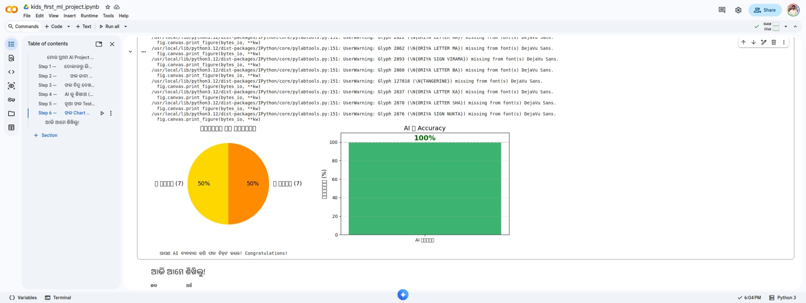

# 🕵️🥭🍊 ମୋର ପ୍ରଥମ AI Project — ଫଳ ଗୋଇନ୍ଦା!
### My First AI Project — The Fruit Detective!

ଏହା ହେଉଛି **ଓଡ଼ିଆ ଭାଷାରେ** ଲେଖା ହୋଇଥିବା ଏକ beginner-friendly Machine Learning project — ଖାସ୍ କରି ପିଲାମାନଙ୍କୁ AI ଶିଖାଇବା ପାଇଁ। ଆସ, ଆମ୍ବ ଓ କମଳା ଚିହ୍ନଟ କରି AI ଶିଖିବା!

> 🎁 **ନୂଆ Bonus Level:** ଶେଷରେ ଦୁଇଟି modern-AI concept ମଧ୍ୟ ରହିଛି — **RAG** (Open-Book AI 📖) ଓ **PCP** (Step-by-Step AI 🔗) — ସେହି ସମାନ ଫଳ-detective style ରେ, ଆଉ ତାହା ପୁଣି ବିନା କୌଣସି extra install ବା API key ରେ।



---

## 🧺 Dataset କଣ? (ଅତି ସହଜ ଭାବରେ — ୫ ବର୍ଷର ପିଲାଙ୍କ ପାଇଁ)

*(English: What is a Dataset? — a super-simple example for a 5-year-old)*

ଭାବିନେ, ତୋ ପାଖରେ ଗୋଟିଏ ଖେଳନା ଟୋକେଇ (🧺) ଅଛି।
ବୋଉ ସେଥିରେ ୩ଟି ଆମ୍ବ ଆଉ ୩ଟି କମଳା ରଖିଦେଲେ (🥭🥭🥭🍊🍊🍊)!

ପ୍ରତିଟି ଫଳ ପାଇଁ ତୁ ଗୋଟିଏ ଛୋଟ ଚିଟ୍ ଲେଖିଲୁ: ଫଳଟି ବଡ଼ ନା ଛୋଟ? ତା'ର ରଙ୍ଗ ହଳଦିଆ ନା କମଳା? 📝

ଏହି ସବୁ ଚିଟ୍ କୁ ଏକାଠି ମିଶାଇଦେଲେ ତାହା ଗୋଟିଏ Dataset ହୋଇଯାଏ — ଠିକ୍ ଫଳମାନଙ୍କର ଗୋଟିଏ ଛୋଟ ଡାଏରୀ ପରି! 📔

> 🤖 **Robot:** "ମୁଁ ତୁମ ପରି ଫଳ ଦେଖି କିମ୍ବା ଚାଖି ପାରିବିନି। ମୋତେ ଖାଲି ସେହି ଚିଟ୍ (Dataset) ଦେଇଦିଅ, ତା'ପରେ ମୁଁ ବି ଶିଖିଯିବି କେଉଁଟା ଆମ୍ବ ଆଉ କେଉଁଟା କମଳା!"

ଗୋଟିଏ ଧାଡ଼ିରେ କହିଲେ: **Dataset ହେଉଛି ବହୁତ ଗୁଡ଼ିଏ ଜିନିଷ ବିଷୟରେ ଲେଖା ହୋଇଥିବା notes**, ଯାହାକୁ ପଢ଼ି ଆମର ଗୋଟିଏ ରୋବଟ୍ ସାଙ୍ଗ ନୂଆ କଥା ଶିଖିପାରିବ।

| ଫଳ | ଆକାର | ରଙ୍ଗ |
|---|---|---|
| ଆମ୍ବ 🥭 | ବଡ଼ | ହଳଦିଆ |
| କମଳା 🍊 | ଛୋଟ | କମଳା |
| ଆମ୍ବ 🥭 | ଛୋଟ | ହଳଦିଆ |

ଏହି ଛୋଟ table ଟି ହିଁ ଆମର ପ୍ରଥମ **Dataset**! ପୂରା project ରେ ଆମେ ଠିକ୍ ଏହିଭଳି — କେବଳ ଆହୁରି ଅଧିକ ଫଳ ସହିତ — dataset ବ୍ୟବହାର କରିବୁ (ତଳେ Step 2 ଦେଖ)।

---

## 📋 ବିଷୟସୂଚୀ (Table of Contents)

1. [🧺 Dataset କଣ? — ୫ ବର୍ଷ ପିଲାଙ୍କ ପାଇଁ](#-dataset-କଣ-ଅତି-ସହଜ-ଭାବରେ--୫-ବର୍ଷର-ପିଲାଙ୍କ-ପାଇଁ)
2. [ସାମଗ୍ରିକ ଚିତ୍ର — Notebook କ'ଣ କରୁଛି?](#-ସାମଗ୍ରିକ-ଚିତ୍ର)
3. [Step 1 — Libraries ଆଣ](#-step-1--libraries-ଆଣ)
4. [Step 2 — Dataset ତିଆର](#-step-2--dataset-ତିଆର)
5. [Step 3 — ଡାଟା ଚିତ୍ର ଦେଖ EDA](#-step-3--ଡାଟା-ଚିତ୍ର-ଦେଖ-eda)
6. [Step 4 — AI ଶିଖାଅ Training](#-step-4--ai-ଶିଖାଅ-training)
7. [Step 5 — ନୂଆ ଫଳ Test](#-step-5--ନୂଆ-ଫଳ-test)
8. [Step 6 — Victory Charts](#-step-6--victory-charts)
9. [🎁 Bonus Step 7 — RAG (Open-Book AI)](#-bonus-step-7--rag-open-book-ai)
10. [🎁 Bonus Step 8 — PCP (Step-by-Step AI)](#-bonus-step-8--pcp-step-by-step-ai)
11. [ଡାଟା ର ଯାତ୍ରା — End-to-End Flow](#-ଡାଟା-ର-ଯାତ୍ରା--end-to-end-flow)
12. [୧୦୦% Accuracy କାହିଁକି?](#-୧୦୦-accuracy-କାହିଁକି)
13. [ଚେଷ୍ଟା କର — Experiments](#-ଚେଷ୍ଟା-କର--experiments)
14. [ML ଶବ୍ଦ ଭଣ୍ଡାର](#-ml-ଶବ୍ଦ-ଭଣ୍ଡାର)
15. [Notebook ଚଲାଅ — How to Run](#-notebook-ଚଲାଅ--how-to-run)
16. [Files ସୂଚୀ](#-files-ସୂଚୀ)
17. https://teachablemachine.withgoogle.com/train/image

---

## 🔭 ସାମଗ୍ରିକ ଚିତ୍ର

ଏହି Notebook ଏକ **binary classification problem** କୁ solve କରୁଛି:
ଫଳର ଓଜନ ଓ ରଙ୍ଗ ଦେଖି — ଏହା **ଆମ୍ବ** ନା **କମଳା**, ତାହା ଏହା ଠିକ୍ କରିବ।

```
Input (ଯାହା ଦେଉ)     →   ML Model     →   Output (ଉତ୍ତର)
[ଓଜନ, ରଙ୍ଗ]              Decision          "ଆମ୍ବ" ବା
                           Tree              "କମଳା"
```

**Machine Learning pipeline (ପ୍ରକ୍ରିୟା):**
```
ଡାଟା ସଂଗ୍ରହ → ଚିତ୍ର ଦେଖ → Model ଶିଖାଅ → ଯାଞ୍ଚ କର → ନୂଆ ଫଳ Test
```

> 🤖 **Robot:** "ଗୋଟିଏ ଫଳ ଦୋକାନୀ ତାଙ୍କ ଚଷ୍ମା ହଜେଇ ଦେଇଛନ୍ତି। ସେ ଆଉ ଫଳ ଚିହ୍ନଟ କରିପାରୁ ନାହାଁନ୍ତି! ମୁଁ ତାଙ୍କୁ help କରିବି! 🕵️"

ଏହି Notebook ଟି ହେଉଛି — **ଗୋଟିଏ Jupyter file** — ଏହାକୁ ଚଲାଇବା ପାଇଁ internet ଲାଗେନି କିମ୍ବା GPU ଲାଗେନି, ଏହା Google Colab ରେ ସମ୍ପୂର୍ଣ୍ଣ free ରେ ଚାଲେ।

---

## 📦 Step 1 — Libraries ଆଣ

> 🤖 **Robot:** "ଖେଳିବା ଆଗରୁ toys ବାହାର କର — ଆଉ coding ଆଗରୁ tools ଆଣ! 🧰"
> *(cricket bat ବିନା କ'ଣ କେବେ cricket ଖେଳ ହୁଏ!)*

### Code:
```python
import numpy as np
import matplotlib.pyplot as plt
from sklearn.tree import DecisionTreeClassifier
from sklearn.metrics import accuracy_score
```

### ପ୍ରତ୍ୟେକ line ର ଅର୍ଥ:

| Library | କ'ଣ କରେ | ଓଡ଼ିଆ ଅର୍ଥ |
|---------|---------|-----------|
| `numpy` | ଦ୍ରୁତ ଗଣିତ — numbers ର list (array) | Calculator ଭଳି 🔢 |
| `matplotlib.pyplot` | Chart ଓ Graph ଆଁକେ | ଚିତ୍ରକର ଭଳି 🎨 |
| `DecisionTreeClassifier` | AI ର brain — data ଦେଖି ଶିଖେ | AI ର ମୁଣ୍ଡ 🧠 |
| `accuracy_score` | Model କେତେ ଠିକ୍ ଉତ୍ତର ଦେଉଛି ଦେଖେ | Marks ଦେଉଥିବା ଶିକ୍ଷକ 📝 |

**`import numpy as np`** — ଏଠାରେ `as np` ହେଉଛି ଗୋଟିଏ shortcut। `numpy.array()` ବୋଲି ଲମ୍ବା ଲେଖିବା ବଦଳରେ ଖାଲି `np.array()` ଲେଖିଲେ କାମ ହୋଇଯିବ — ଏଥିରେ ଆମ ସମୟ ବଞ୍ଚିବ!

**`from sklearn.tree import DecisionTreeClassifier`** — ଆମେ sklearn ର `tree` section ରୁ ଆମର AI brain କୁ ଆଣୁଛୁ। Decision Tree ଠିକ୍ ଏହିଭଳି ଭାବେ — *"ଓଜନ > 120g କି? ହଁ → କମଳା। ନା → ଆମ୍ବ।"*

### Output:
```
========================================
🤖 Robot: 'ସବୁ tools ଆସିଗଲା!'
🎒 Backpack ଭର୍ତ୍ତି! Mission start! 🚀
========================================
✅ numpy    — calculator ଭଳି (ଗଣିତ ପାଇଁ)
✅ matplotlib — ଚିତ୍ରକର ଭଳି (chart ଆଁକିବ)
✅ sklearn  — AI ର super brain! 🧠
🎉 READY TO ROLL!
```

---

## 🥭🍊 Step 2 — Dataset ତିଆର

> 🕵️ **Detective Robot:** "ଫଳ ଚିହ୍ନଟ କରିବା ପାଇଁ ଦୁଇଟି clue ଯଥେଷ୍ଟ!"

**Clue 1 🔍:** ଆମ୍ବ ହାଲୁକା ହୁଏ (80–110g), ଆଉ କମଳା ଭାରୀ ହୁଏ (130–200g)
**Clue 2 🎨:** ଆମ୍ବ ହଳଦିଆ (color=0), ଆଉ କମଳା ଲାଲ୍/କମଳା ରଙ୍ଗର ହୁଏ (color=1)

### Dataset:
| ଫଳ | Samples | ଓଜନ | ରଙ୍ଗ code |
|-----|---------|-----|----------|
| 🥭 ଆମ୍ବ | 7 ଟି | 80–110g | 0 (ହଳଦିଆ) |
| 🍊 କମଳା | 7 ଟି | 130–200g | 1 (କମଳା) |

### Code ର ଅର୍ଥ:

```python
fruits_data = [
    [150, 1],  # 🍊 କମଳା — "ମୁଁ ଭାରୀ ଓ ଗୋଲ!"
    [170, 1],  # 🍊 କମଳା — "Gym ଯାଏ 💪"
    ...
    [90,  0],  # 🥭 ଆମ୍ବ — "ଆମ୍ବ ରାଜା! 👑"
    [100, 0],  # 🥭 ଆମ୍ବ — "Alphonso ବଂଶ 😌"
]
```
- ଏହା ହେଉଛି ଏକ **Python list of lists** — ପ୍ରତ୍ୟେକ ଛୋଟ list `[ଓଜନ, ରଙ୍ଗ]` ଗୋଟିଏ ଗୋଟିଏ ଫଳକୁ ବୁଝାଏ।
- ଆମ ପାଖରେ ମୋଟ **14 ଟି ଫଳ** ଅଛି — 7 ଟି ଆମ୍ବ + 7 ଟି କମଳା।
- ଆମ୍ବ (80–110g) ଓ କମଳା (130–200g) ମଧ୍ୟରେ **20g gap** ରହିଛି — ତେଣୁ AI ଏହାକୁ ବହୁତ ସହଜରେ ଶିଖିଯିବ।

```python
labels = [1, 1, 1, 1, 1, 1, 1,   # ← 7 ଟି କମଳା
          0, 0, 0, 0, 0, 0, 0]   # ← 7 ଟି ଆମ୍ବ
```
- ଏହା ହେଉଛି **ଉତ୍ତର list** — `fruits_data` ର ପ୍ରତ୍ୟେକ ଫଳ ପାଇଁ ଠିକ୍ ଉତ୍ତର।
- Position 0 (`[150,1]`) → ର label 0 (`1`) → ମାନେ କମଳା।
- **ଦୁଇଟିଯାକ list ର ଧାଡ଼ି ସମାନ ହେବା ନିହାତି ଦରକାର** — ନ ହେଲେ AI ଭୁଲ୍ ଶିଖିଯିବ!

```python
X = np.array(fruits_data)   # shape: (14, 2)
y = np.array(labels)        # shape: (14,)
```
- ML ରେ `X` = **features (input)**, ଆଉ `y` = **labels (ଉତ୍ତର)** — ଏହା ସାରା ଦୁନିଆରେ worldwide convention ଭାବେ ବ୍ୟବହାର ହୁଏ।
- `X` ର shape ହେଉଛି `(14, 2)` — ମାନେ 14 ଟି ଫଳ, ଆଉ ପ୍ରତ୍ୟେକ ଫଳ ପାଇଁ 2 ଟି feature।

```python
print(f"🥭 Team Mango: {sum(y==0)} ଟି")
```
- `y==0` — ଏହା ଏକ boolean array (`True/False`)। `sum()` — ଏହା କେତୋଟି True ଅଛି ତାହା ଗଣେ → ଆମ୍ବର count।
- `f"..."` — ଏହାକୁ **f-string** କୁହାଯାଏ: `{}` ଭିତରେ ତୁମେ ସିଧାସଳଖ Python expression ଲେଖିପାରିବ।

### Output:
```
🗂️  EVIDENCE COLLECTED!
======================================
🥭 Team Mango  (ଆମ୍ବ team) : 7 ଟି
🍊 Team Orange (କମଳା team): 7 ଟି
📦 ମୋଟ suspects           : 14 ଟି
======================================
```

---

## 📊 Step 3 — ଡାଟା ଚିତ୍ର ଦେଖ (EDA)

**EDA = Exploratory Data Analysis** — ମାନେ training ଦେବା ଆଗରୁ ଡାଟାକୁ ଭଲ ଭାବରେ ଦେଖ, ଆଉ ତା' ଭିତରେ pattern ଖୋଜ।

> 💡 ଯଦି chart ରେ ଦୁଇଟି ଗ୍ରୁପ୍ ପୂରା ଅଲଗା ଅଲଗା ଦେଖାଉଛି — ତେବେ AI ବହୁତ ସହଜରେ ଶିଖିବ। ଯଦି ସେଗୁଡ଼ିକ ଏକାଠି ମିଶିକରି ଥିବେ — ତେବେ accuracy କମ୍ ହୋଇଯାଏ।

### Code ର ଅର୍ଥ:

```python
plt.figure(figsize=(9, 5))
```
- ଏହା ଗୋଟିଏ ଖାଲି canvas ତିଆରି କରେ — 9 inch ଚଉଡ଼ା, ଆଉ 5 inch ଉଚ୍ଚ।

```python
mango_weights = [X[i][0] for i in range(len(y)) if y[i] == 0]
```
- **List comprehension** — ଏହା ଗୋଟିଏ compact loop। ଆମ୍ବର ଓଜନଗୁଡ଼ିକୁ ବାଛି ଗୋଟିଏ ଅଲଗା list କୁ ଆଣ।
- `X[i][0]` = i-ତମ ଫଳର ଓଜନ (column 0)।

```python
plt.scatter(..., color='gold', s=300, zorder=3, edgecolors='darkorange')
```
- `scatter()` = dots chart ବା ବିନ୍ଦୁ ଥିବା ଗ୍ରାଫ୍। `s=300` = dot ର ଆକାର। `zorder=3` = grid ଉପରେ dots ଗୁଡ଼ିକୁ ଉପରକୁ ଦେଖାଇବ।

```python
plt.axhline(y=120, color='red', linestyle='--', alpha=0.5)
```
- 120g ରେ ଗୋଟିଏ dashed line ଅଛି — ଯାହାକି **ଦୁଇ ଗ୍ରୁପ୍ ର boundary**। Decision Tree ଠିକ୍ ଏଇଠି ହିଁ split ନେବ।
- `alpha=0.5` = 50% transparent — ଅର୍ଥାତ୍ ଲାଇନ୍ ଟି ଆମ dots ଗୁଡ଼ିକୁ ଲୁଚାଇବ ନାହିଁ।

### ଦେଖ:
- 🟡 ହଳଦିଆ dots ଗୁଡ଼ିକ **120g ତଳେ ଅଛି** → ମାନେ ଆମର 7 ଟି ଆମ୍ବ
- 🟠 କମଳା ରଙ୍ଗର dots ଗୁଡ଼ିକ **120g ଉପରେ ଅଛି** → ମାନେ ଆମର 7 ଟି କମଳା
- ଦୁଇଟିଯାକ ଗ୍ରୁପ୍ **ସ୍ପଷ୍ଟ ଭାବେ ଅଲଗା ଅଛନ୍ତି** — ଏହାକୁ *linearly separable* ବୋଲି କୁହାଯାଏ।

---

## 🧠 Step 4 — AI ଶିଖାଅ (Training)

> 🤖 **Robot:** "ତୁମେ ଖାଇ ଖାଇ ଶିଖ (experience)। ଆଉ ମୁଁ data ଦେଖି ଶିଖେ (training)! ତୁମକୁ ଯାହା ଶିଖିବାକୁ 10 ବର୍ଷ ଲାଗେ... ମୁଁ ତାହା 0.001 second ରେ ଶିଖିଯାଏ! 😏"

### Code ର ଅର୍ଥ:

```python
model = DecisionTreeClassifier(random_state=42)
```
- ଗୋଟିଏ ନୂଆ **Model object** ତିଆରି ହେଲା — ବର୍ତ୍ତମାନ ଏହା ଏକ ପୂରା ଖାଲି brain।
- `random_state=42` = ଏହା ହେଉଛି **random seed** — ଯାହାଫଳରେ ପ୍ରତିଥର code ଚଲାଇଲେ ସମାନ ଫଳାଫଳ ମିଳିବ। 42 ଏଠି ଗୋଟିଏ popular choice (ଯାହାକି ଗୋଟିଏ pop culture reference — *Hitchhiker's Guide to the Galaxy* ରୁ ଆସିଛି)।
- Decision Tree ସବୁବେଳେ ଏହିଭଳି ଭାବେ:
```
ଓଜନ > 120g?
├── ହଁ → 🍊 କମଳା
└── ନା → 🥭 ଆମ୍ବ
```

```python
model.fit(X, y)
```
- **ପୂରା code ରେ ଏହା ହେଉଛି ସବୁଠାରୁ ଗୁରୁତ୍ୱପୂର୍ଣ୍ଣ line।**
- `.fit()` ର ଅର୍ଥ ହେଲା **training**। ସେହି 14 ଟି ଫଳ ଓ ତା'ର ଉତ୍ତରକୁ ଦେଖି ଆମ AI pattern ଶିଖେ।
- ସେ ଭିତରେ ଭିତରେ ଭାବେ: "ଓଜନ > 80? ଓଜନ > 85? ... ଓଜନ > 120?" — ଏମିତି ସବୁ try କରି ସବୁଠୁ best split ଟାକୁ ବାଛିଥାଏ।
- ଆଜିକାଲିର computer ରେ ଏଥିପାଇଁ **1 millisecond** ରୁ ବି କମ୍ ସମୟ ଲାଗେ!

```python
predictions = model.predict(X)
accuracy    = accuracy_score(y, predictions) * 100
```
- `.predict(X)` = model ତା'ର ନିଜ ଶିଖିଥିବା ଜ୍ଞାନକୁ ବ୍ୟବହାର କରି ଉତ୍ତର ଦିଏ।
- `accuracy_score(y, predictions)` = ଠିକ୍ ଉତ୍ତର ÷ ମୋଟ × 100 = **14/14 × 100 = 100%**
- `{accuracy:.0f}` — f-string ରେ `.0f` ମାନେ 0 decimal place (100.0 କୁ ସିଧା 100 କରିଦିଏ)।

### Output:
```
🎓 TRAINING REPORT CARD
===================================
📝 AI ର Marks   : 100% 📊
📚 Questions    : 14 ଟି ଫଳ
✅ Correct      : 14 ଟି
===================================
🎉 ୧୦୦%!! ଆମ AI ପୂରା TOPPER ହୋଇଗଲା!!
🤖 Robot: 'ସାର୍ ମୋତେ Gold Medal ଦିଅନ୍ତୁ! 🥇'
🏫 School: 'ତୁ ତ ଗୋଟେ Robot... ତୋତେ Medal ମିଳିବନି 😤'
🤖 Robot: '...okay fine 😞'
```

---

## 🔍 Step 5 — ନୂଆ ଫଳ Test

> 🕵️ **Detective Robot:** "Mystery fruits ଆସୁଛନ୍ତି! ସେମାନେ ମୁହଁରେ mask ପିନ୍ଧିଛନ୍ତି ସତ... କିନ୍ତୁ ନିଜର ଓଜନ କେମିତି ଲୁଚାଇବେ! 😏"

### Code ର ଅର୍ଥ:

```python
new_fruits = [
    [155, 1],   # Mystery Fruit A — ଭାରୀ + କମଳା ରଙ୍ଗ
    [ 92, 0],   # Mystery Fruit B — ହାଲୁକା + ହଳଦିଆ
    [175, 1],   # Mystery Fruit C — ଅତ୍ୟଧିକ ଭାରୀ
    [ 88, 0],   # Mystery Fruit D — ଛୋଟ + ହଳଦିଆ
]
```
- ଏହି 4 ଟି ଫଳକୁ model ଆଗରୁ କେବେ **ଦେଖି ନ ଥିଲା** — ତେଣୁ ଏହା ହେଉଛି ତା'ର real-world test।

```python
label_map = {0: '🥭 ଆମ୍ବ (MANGO!)', 1: '🍊 କମଳା (ORANGE!)'}
```
- ଏହା ଗୋଟିଏ Python **dictionary** — ଯାହାକି 0 ଓ 1 ସଂଖ୍ୟାକୁ readable name ରେ convert କରିଦିଏ।

```python
results = model.predict(np.array(new_fruits))
```
- ଏବେ Decision Tree ନିଜ ଭିତରେ ପ୍ରଶ୍ନ ପଚାରେ: *"ଓଜନ > 120 କି?"*
  - A (155g) → ହଁ → 🍊 ✅
  - B (92g)  → ନା → 🥭 ✅
  - C (175g) → ହଁ → 🍊 ✅
  - D (88g)  → ନା → 🥭 ✅

```python
for i, (fruit, result) in enumerate(zip(new_fruits, results)):
    color_name = 'ହଳଦିଆ' if fruit[1] == 0 else 'କମଳା'
    print(f"{fruit_emojis[i]} Fruit {fruit_names[i]}: {fruit[0]}g {color_name:>6} → {label_map[result]}")
```
- `zip()` = ଏହା ଦୁଇଟି list କୁ ଏକାସାଥିରେ loop କରେ।
- `enumerate()` = ଆମକୁ index `i` ମଧ୍ୟ ଯୋଗାଇଦିଏ।
- `{color_name:>6}` = ଏହା ଶବ୍ଦକୁ 6 character ରେ right-align କରେ (ଯାହାଫଳରେ ଗୋଟିଏ neat column ତିଆରି ହୁଏ)।

### Output:
```
🔍 DETECTIVE REPORT — MYSTERY FRUITS EXPOSED! 🎉
================================================
🎭 Fruit A:  155g  କମଳା  →  🍊 କମଳା (ORANGE!)
🥸 Fruit B:   92g  ହଳଦିଆ →  🥭 ଆମ୍ବ (MANGO!)
🤔 Fruit C:  175g  କମଳା  →  🍊 କମଳା (ORANGE!)
😶 Fruit D:   88g  ହଳଦିଆ →  🥭 ଆମ୍ବ (MANGO!)
================================================
🤖 Robot: 'ମୁଁ ସବୁ ଚିହ୍ନଟ କରିଦେଲି! ଏବେ ଆଇସ୍କ୍ରିମ୍ ମିଳିବ ତ? 🍦'
```

---

## 🏆 Step 6 — Victory Charts

> 🤖 **Robot:** "ୟେସ୍! ମୁଁ ୧୦୦% ପାଇଲି! ମୋ Chart ଦେଖ! ଦେଖ! 👀 *(Robot ଖୁସିରେ dance କରୁଛି... ସତରେ robots ମାନେ dance କରନ୍ତି କି?)*"

### Code ର ଅର୍ଥ:

```python
fig, axes = plt.subplots(1, 2, figsize=(13, 5))
```
- ଏହାଦ୍ୱାରା **2 ଟି chart ପାଖାପାଖି (side by side) ଆସିବ** — `axes[0]` ହେଲା ବାମ ପଟର, ଆଉ `axes[1]` ଡାହାଣ ପଟର।

**Chart 1 — Pie Chart:**
```python
axes[0].pie([7, 7], autopct='%1.0f%%', explode=(0.05, 0.05), shadow=True)
```
- `[7, 7]` = ଏହା ହେଉଛି ସମାନ ଭାଗ (50-50)। `autopct` = ଏହା % label କୁ auto generate କରେ। `explode` = ଦେଖିବାକୁ ଟିକେ dramatic ଲାଗିବା ପାଇଁ slice ଟିକେ ବାହାରକୁ ବାହାରି ଆସେ। `shadow=True` = ଏହା 3D ଛାୟା ପକାଏ।

**Chart 2 — Bar Chart:**
```python
axes[1].set_ylim(0, 115)
axes[1].text(0, accuracy + 3, f'{accuracy:.0f}% 🥳', ha='center', fontsize=18)
axes[1].axhline(y=100, color='gray', linestyle='--')
```
- `ylim(0, 115)` = ଏହା y-axis କୁ 115 ପର୍ଯ୍ୟନ୍ତ ବଢ଼ାଇଦିଏ — ଯାହାଫଳରେ `100% 🥳` text ଲେଖିବା ପାଇଁ ଟିକେ ଖୋଲା ଜାଗା ମିଳିବ।
- `axhline(y=100)` = ଏହା perfect score ପାଇଁ ଗୋଟିଏ dashed reference line ଟାଣିଦିଏ।

### Output:
- 🥧 ଗୋଟିଏ 50/50 pie chart — ଦୁଇଟିଯାକ team ପୂରା ସମାନ ସମାନ
- 📊 ଗୋଟିଏ ସବୁଜ ରଙ୍ଗର bar ଯେଉଁଥିରେ 100% ଲେଖାହୋଇଛି — ୟେ ହେଲା ଆମ AI ର report card!

---

## 🎁 Bonus Step 7 — RAG (Open-Book AI)

> 🤖 **Robot:** "ଫଳ ଚିହ୍ନଟ କରିବା ତ ହୋଇଗଲା! ଏବେ ମୁଁ **ବହି ଖୋଜି କଥା** ମଧ୍ୟ କହିପାରିବି! 📖"

**RAG = Retrieval-Augmented Generation** — ଆଜିକାଲିର AI (ଯେମିତିକି ChatGPT) ମାନଙ୍କର ଏହା ଏକ trick। Model ସବୁକିଛି ନିଜ ମନରେ ରଖେ ନାହିଁ — ପ୍ରଶ୍ନ ଆସିଲେ ସେ ଆଗ **ବହିରୁ ଠିକ୍ page ଟି ଖୋଜେ (Retrieval)**, ତା'ପରେ ନିଜେ **ଉତ୍ତର ତିଆରି କରେ (Generation)**। ପୂରାପୂରି ଗୋଟିଏ **open-book exam** ଦେଲା ପରି! 😎

> 💡 ଏଥିପାଇଁ କୌଣସି **ନୂଆ install ଦରକାର ନାହିଁ କି API key ବି ଦରକାର ନାହିଁ** — ଆମର ସେହି ପୁରୁଣା `sklearn` ହିଁ ଯଥେଷ୍ଟ।

### Code ର ଅର୍ଥ:

```python
from sklearn.feature_extraction.text import TfidfVectorizer
from sklearn.metrics.pairwise import cosine_similarity

fruit_book = [
    "ଆମ୍ବ ହାଲୁକା ହୁଏ, ଓଜନ 80 ରୁ 110 gram...",
    "କମଳା ଭାରୀ ହୁଏ, ଓଜନ 130 ରୁ 200 gram...",
    ...
]
book_vectors = TfidfVectorizer().fit_transform(fruit_book)
```
- `fruit_book` = ଏହା ହେଲା Robot ର **knowledge base** — ଫଳ ବିଷୟରେ ଥିବା facts ର ପ୍ରତ୍ୟେକ line ଏଥିରେ ଗୋଟିଏ ଗୋଟିଏ "page" ପରି କାମ କରେ।
- `TfidfVectorizer` ପ୍ରତ୍ୟେକ page କୁ ଗୋଟିଏ **"meaning fingerprint"** (numbers) ରେ ବଦଳାଇଦିଏ — ଏହାକୁ *embedding* କୁହାଯାଏ।

```python
scores = cosine_similarity(q_vec, book_vectors)[0]
best   = scores.argmax()      # ସବୁଠୁ ଭଲ page
```
- ଆମ ପ୍ରଶ୍ନର fingerprint ବହିର ପ୍ରତ୍ୟେକ page ସହ କେତେ ମେଳ ଖାଉଛି — `cosine_similarity` ତାହା ମାପିଥାଏ।
- `argmax()` = ଏହା ସବୁଠାରୁ ଅଧିକ ମେଳ ଖାଉଥିବା page ଟିକୁ ବାଛିଥାଏ → ଏହାକୁ ହିଁ କୁହନ୍ତି **Retrieval!**

### Output:
```
❓ ପ୍ରଶ୍ନ  : କମଳା ର ଓଜନ କେତେ?
🔍 Robot book ଖୋଜିଲା (match score = 0.30)
   📖 Page: କମଳା ଭାରୀ ହୁଏ, ଓଜନ 130 ରୁ 200 gram...
🤖 Robot : 'କମଳା ଭାରୀ ହୁଏ, ଓଜନ 130 ରୁ 200 gram — ଏଇଟି ମୋ ଉତ୍ତର!'
```

> ✨ **ମୂଳ କଥା:** Robot ନିଜ ମନରୁ କିଛି ମନେ ରଖି ନାହିଁ — ତୁମେ ଯଦି ବହିଟା ବଦଳାଇ ଦେବ, ତା'ର ଉତ୍ତର ଆପେ ଆପେ ବଦଳିଯିବ। ୟା ପାଇଁ କୌଣସି **re-training ର ଆବଶ୍ୟକତା ନାହିଁ!** ଏଇଟି ହିଁ ତ RAG ର ଅସଲ superpower।

---

## 🎁 Bonus Step 8 — PCP (Step-by-Step AI)

> 🤖 **Robot:** "ମୁଁ ବଡ଼ ପ୍ରଶ୍ନକୁ ଏକାଥରେ ନୁହେଁ — ବରଂ ତାକୁ **ଛୋଟ ଛୋଟ step** ରେ ଭାଙ୍ଗିକରି solve କରେ! ପୂରା relay race ଭଳି 🏃→🏃→🏃"

**PCP = Prompt Chaining Pattern** — ଗୋଟିଏ ବଡ଼ କାମକୁ ଛୋଟ ଛୋଟ step ର ଏକ **chain** ରେ ଭାଙ୍ଗିଦେବା। ଏଠାରେ ପ୍ରତ୍ୟେକ step ର ଉତ୍ତର ତା'ର ପରବର୍ତ୍ତୀ step କୁ ଗୋଟିଏ **baton** ଭଳି pass ହୋଇଯାଏ 🥎।

**ଆମ chain:** ମାପ → ତୁଳନା → ନିଷ୍ପତ୍ତି → ବୁଝାଅ

### Code ର ଅର୍ଥ:

```python
def robot_thinks(fruit):
    w, c  = step1_measure(fruit)   # 🥎 baton 1 — ଓଜନ ଓ ରଙ୍ଗ ମାପ
    h, c  = step2_compare(w, c)    # 🥎 baton 2 — 120g boundary ସହ ତୁଳନା
    guess = step3_decide(h, c)     # 🥎 baton 3 — ଆମ୍ବ ନା କମଳା ନିଷ୍ପତ୍ତି
    step4_explain(guess)           # 🥎 baton 4 — କାରଣ ବୁଝାଅ
    return guess
```
- ଏଥିରେ ପ୍ରତ୍ୟେକ `step` ର **output** ଟି ପରବର୍ତ୍ତୀ step ର **input** ହୋଇଯାଏ।
- ପ୍ରତ୍ୟେକ step ବହୁତ ଛୋଟ, ସହଜ ଓ ସେଗୁଡ଼ିକୁ **ଅଲଗା ଅଲଗା check** ମଧ୍ୟ କରିହେବ — ଯଦି କେଉଁଠି କିଛି ଭୁଲ୍ ହୁଏ, ତେବେ ତାହା ବହୁତ ସହଜରେ ଧରାପଡ଼ିଯାଏ।

### Output:
```
🎭 Mystery Fruit ଆସିଲା: [175, 1]
🥎 Step 1 — ମାପ    : ଓଜନ = 175g, ରଙ୍ଗ code = 1
🥎 Step 2 — ତୁଳନା  : 120g boundary ସହ → ଭାରୀ 💪
🥎 Step 3 — ନିଷ୍ପତ୍ତି: ଏଇଟି 🍊 କମଳା
🥎 Step 4 — ବୁଝାଅ   : '🍊 କମଳା, କାରଣ ଏହା ଭାରୀ ଓ କମଳା ରଙ୍ଗ!'
```

> ✨ **RAG ଓ PCP ମିଶିଲେ:** ବଡ଼ ବଡ଼ AI assistant ମାନେ ଏହି ଦୁଇଟିଯାକ ଟେକନିକ୍ କୁ ଏକାଠି ବ୍ୟବହାର କରନ୍ତି — **RAG ନୂଆ facts ଆଣିଦିଏ**, ଆଉ ତା'ପରେ **PCP ସେଇ facts ଗୁଡ଼ିକୁ step-by-step process କରି** ଶେଷ ଉତ୍ତର ଦିଏ।

---

## 🔄 ଡାଟାର ଯାତ୍ରା — End-to-End Flow

```
Step 2: Python list ତିଆର
fruits_data = [[150,1],[170,1],...,[90,0],[80,0],...]
labels      = [1,1,1,1,1,1,1,0,0,0,0,0,0,0]
        ↓
np.array() — numpy array ରେ convert
X.shape = (14, 2)   ← 14 ଫଳ, 2 feature
y.shape = (14,)     ← 14 ଉତ୍ତର
        ↓
Step 3: EDA — X[i][0] → ଓଜନ → scatter plot dots
        ↓
Step 4: Training
model.fit(X, y)
→ Decision Tree ଶିଖିଲା: "ଓଜନ > 120 → କମଳା, ନ ହେଲେ → ଆମ୍ବ"
        ↓
Step 4: Self-test
model.predict(X) → [1,1,1,1,1,1,1,0,0,0,0,0,0,0]
accuracy_score   → 14/14 = 100%
        ↓
Step 5: ନୂଆ ଫଳ predict
new_fruits = [[155,1],[92,0],[175,1],[88,0]]
model.predict() → [1, 0, 1, 0]
→ କମଳା, ଆମ୍ବ, କମଳା, ଆମ୍ବ
        ↓
Step 6: Charts — Pie + Bar
```

---

## 💯 ୧୦୦% Accuracy କାହିଁକି?

> ⚠️ ଗୋଟିଏ ଆସଲ ML project ରେ ୧୦୦% accuracy ଆସିବାଟା **normal କଥା ନୁହେଁ!** ଆମର ଏଠି ୧୦୦% ଆସିବା ପଛରେ 3 ଟି କାରଣ ରହିଛି:

**କାରଣ 1 — ଡାଟାଗୁଡ଼ିକ ପୂରା ସ୍ପଷ୍ଟ ଭାବେ ଅଲଗା ଅଛନ୍ତି:**
ଆମ୍ବ (80–110g) ଓ କମଳା (130–200g) ର ଓଜନ ମଧ୍ୟରେ 20g ର gap ରହିଛି। ସେଥିପାଇଁ Decision Tree ଖାଲି ଗୋଟିଏ ପ୍ରଶ୍ନ ପଚାରି ସବୁକିଛି ଠିକ୍ କରିଦେଲା।

**କାରଣ 2 — Training data ଉପରେ ହିଁ ଆମେ test କଲୁ:**
`model.predict(X)` — ମାନେ ସେ ଯେଉଁ ଡାଟା ଦେଖି ଶିଖିଥିଲା, ଆମେ ପୁଣି ସେଇଥିରେ ହିଁ ତା'ର test ନେଲୁ। ଏହା ଠିକ୍ ସେମିତି ହେଲା ଯେମିତି ଜଣେ ଛାତ୍ର ଆଗରୁ ଉତ୍ତର ଜାଣିସାରି ପରୀକ୍ଷା ଦେଲା! ଆସଲ ML ରେ **train/test split** ର ନିହାତି ଦରକାର ପଡ଼ିଥାଏ:
```python
from sklearn.model_selection import train_test_split
X_train, X_test, y_train, y_test = train_test_split(X, y, test_size=0.2)
model.fit(X_train, y_train)
accuracy = accuracy_score(y_test, model.predict(X_test))
```

**କାରଣ 3 — ଆମ Dataset ଟି ଅତ୍ୟଧିକ ଛୋଟ:**
ଆମର ଏଠି କେବଳ 14 ଟି samples ଅଛି — କିନ୍ତୁ ଆସଲ project ମାନଙ୍କରେ ହଜାର ହଜାର samples ଥାଏ।

**Overfitting କ'ଣ?**
ଯଦି ଆମ୍ବ ଓ କମଳାର ଓଜନ ପରସ୍ପର ସହ overlap ହେଉଥାନ୍ତା (ଯେମିତିକି ଆମ୍ବର ଓଜନ ଯଦି 145g ଥାନ୍ତା), ତେବେ model ଟି training data କୁ ଘୋଷିଦେଇଥାନ୍ତା (**rote learn** କରନ୍ତା) — ଆଉ ନୂଆ ଫଳ ଦେଖିଲା ବେଳକୁ fail ହୋଇଯାଆନ୍ତା। ଏହାକୁ ହିଁ ମଜାରେ **overfitting** (ବା Robot ର rote-learn 😂) ବୋଲି କୁହାଯାଏ।

---

## 🧪 ଚେଷ୍ଟା କର — Experiments

### Experiment 1 — ଗୋଳମାଳ ଫଳ ଯୋଡ଼
```python
# 145g ଆମ୍ବ — কমলার range ରେ overlap!
fruits_data.append([145, 0])
labels.append(0)
```
→ ଏହା କଲେ Accuracy 100% ରୁ ତଳକୁ ଖସିଯିବ — ଟିକେ ଦେଖିଲୁ AI କେମିତି confuse ହୋଇଯାଉଛି!

### Experiment 2 — ରଙ୍ଗକୁ ବାଦ୍ ଦିଅ
```python
X_weight_only = X[:, 0:1]   # ଶୁଧୁ ଓଜନ
model.fit(X_weight_only, y)
```
→ ଏହି dataset ରେ ଖାଲି ଓଜନକୁ ଦେଖିଲେ ବି ଯଥେଷ୍ଟ ହେବ। Accuracy ତଥାପି 100% ହିଁ ରହିବ — ମାନେ ଏଠି ରଙ୍ଗର କିଛି ଦରକାର ନାହିଁ (redundant)!

### Experiment 3 — 3ୟ ଫଳ ଯୋଡ଼ (Multi-class)
```python
# ଅଙ୍ଗୁର — ଅତ୍ୟଧିକ ହାଲୁକା, 20–40g, color=2
fruits_data += [[25,2],[30,2],[35,2]]
labels      += [2, 2, 2]
```
→ ଏହାଦ୍ୱାରା ୟେ **3-class classification!** ହୋଇଯିବ। ଆମ Decision Tree ତାକୁ ଆପେ ଆପେ handle କରିଦେବ।

### Experiment 4 — ଅଲଗା Algorithm ବ୍ୟବହାର କର
```python
from sklearn.neighbors import KNeighborsClassifier
model = KNeighborsClassifier(n_neighbors=3)
model.fit(X, y)
```
→ ୟାକୁ ଆମ Decision Tree ସହିତ compare କରିଦେଖ। ଏଇଠି ଦୁଇଟିଯାକ 100% ମାର୍କ ହିଁ ରଖିବେ।

### Experiment 5 — Train/Test Split (ଆସଲ ପଦ୍ଧତି)
```python
from sklearn.model_selection import train_test_split
X_train, X_test, y_train, y_test = train_test_split(X, y, test_size=0.3, random_state=42)
model.fit(X_train, y_train)
print(f"Test accuracy: {accuracy_score(y_test, model.predict(X_test))*100:.0f}%")
```
→ Model ଆଗରୁ କେବେ ଦେଖିନଥିବା data ରେ ତା'ର test ନିଅ — ଏହା ହେଉଛି ଆସଲ evaluation!

---

## 📚 ML ଶବ୍ଦ ଭଣ୍ଡାର

| ML ଶବ୍ଦ | ଅର୍ଥ | ମଜାଳିଆ ଉଦାହରଣ 😂 |
|---------|------|-----------------|
| **Dataset** | ଶିଖିବା ପାଇଁ ଡାଟା | AI ର Tiffin box 🍱 |
| **Feature** | Input ର ଗୁଣ (ଓଜନ, ରଙ୍ଗ) | ଫଳର ପରିଚୟ card |
| **Label** | ଠିକ୍ ଉତ୍ତର (0 ବା 1) | ପ୍ରଶ୍ନପତ୍ରର answer key |
| **Training** | AI କୁ ଡାଟା ଦେଖାଇ ଶିଖାଇବା | Robot School 🏫 |
| **Model** | Trained AI (Decision Tree) | Robot ର ମୁଣ୍ଡ 🤖 |
| **Prediction** | Model ର ଉତ୍ତର | Robot ର guess 🎯 |
| **Accuracy** | ଠିକ୍ ଉତ୍ତରର % | Report Card 📝 |
| **Overfitting** | Rote learn — ଆସଲରେ କିଛି ଶିଖିନାହିଁ | Robot ମୁଣ୍ଡ ପୋତି ଘୋଷିବା 😂 |
| **EDA** | Training ଦେବା ଆଗରୁ data ର ଚିତ୍ର ଦେଖିବା | ଖେଳିବା ଆଗରୁ field ଦେଖିବା |
| **RAG** | ଆଗ ବହି ଖୋଜ, ତା'ପରେ ଉତ୍ତର ଦିଅ | Open-book exam 📖 |
| **Retrieval** | ଠିକ୍ page ବା document ଖୋଜିବା | ବହିରେ bookmark ଦେବା ⭐ |
| **Embedding** | ଶବ୍ଦର "meaning fingerprint" | ପ୍ରତ୍ୟେକ line ର ID card 🪪 |
| **PCP** | ବଡ଼ କାମକୁ ଛୋଟ ଛୋଟ step ର chain କରିବା | Relay race 🏃→🏃 |
| **Chaining** | ଗୋଟିଏ step ର ଉତ୍ତର ଅନ୍ୟଟିକୁ ଦେବା | Baton pass କରିବା 🥎 |

---

## 🚀 Notebook ଚଲାଅ — How to Run

**Option 1 — Google Colab (ସବୁଠୁ ସହଜ ଉପାୟ):**
1. `kids_first_ml_project.ipynb` ଫାଇଲ୍ ଟିକୁ ନେଇ Google Drive ରେ upload କର।
2. ତାକୁ Colaboratory ରେ open କର।
3. ତା'ପରେ Shift+Enter ଦବାଇ cell ଗୁଡ଼ିକୁ ଚଲାଅ।

**Option 2 — Local Jupyter ରେ ଚଲାଇବା ପାଇଁ:**
```bash
pip install numpy matplotlib scikit-learn jupyter
jupyter notebook kids_first_ml_project.ipynb
```

**Dependencies (କ'ଣ ସବୁ ଦରକାର):**
```bash
pip install numpy matplotlib scikit-learn
```

---

## 📁 Files ସୂଚୀ

| File | ବିବରଣୀ |
|------|--------|
| `kids_first_ml_project.ipynb` | ସମ୍ପୂର୍ଣ୍ଣ ML tutorial notebook (ଓଡ଼ିଆ + Python) |
| `NOTEBOOK_EXPLAINED.md` | ପ୍ରତ୍ୟେକ cell ର English ରେ detail ବ୍ୟାଖ୍ୟା |
| `fine-tuning-hyperparameter-comparison.csv` | Hyperparameter ର ଉଦାହରଣ (ଓଡ଼ିଆ + Advanced) |
| `notebook-output-colab.jpeg` | Colab ରେ ଏହା ଚାଲୁଥିବା ବେଳର screenshot |
| `Fine_Tuning_Hyperparameter_Odia_FUNNY_Guide.pdf` | ଗୋଟିଏ funny hyperparameter guide (ଓଡ଼ିଆରେ) |
| `Fine_Tuning_Hyperparameter_Odia_Simple_Guide.pdf` | ଗୋଟିଏ simple hyperparameter guide (ଓଡ଼ିଆରେ) |

---

## 📊 Notebook — ପ୍ରତ୍ୟେକ Cell ଉପରେ ଏକ ନଜର

| Cell | ପ୍ରକାର | କ'ଣ କରେ | ML Concept |
|------|--------|---------|------------|
| cell-0 | Markdown | Problem + Story | Problem definition |
| cell-1 | Markdown | Step 1 intro | Analogy |
| cell-2 | Code | Libraries import | numpy, matplotlib, sklearn |
| cell-3 | Markdown | Feature table | Features & labels |
| cell-4 | Code | Dataset (X, y) ତିଆରି | Array, labels, f-string |
| cell-5 | Markdown | EDA intro | EDA concept |
| cell-6 | Code | Scatter plot | Visualisation, separability |
| cell-7 | Markdown | Training analogy | Training concept |
| cell-8 | Code | Model train + evaluate | `.fit()`, `.predict()`, accuracy |
| cell-9 | Markdown | Mystery fruit intro | Inference |
| cell-10 | Code | ନୂଆ ଫଳ predict କରିବା | `.predict()`, dict, zip |
| cell-11 | Markdown | Victory intro | Celebration |
| cell-12 | Code | Pie + Bar charts | subplots, pie, bar, axhline |
| cell-13 | Markdown | Glossary + next steps | Recap |
| Bonus | Markdown | Bonus Level intro (RAG vs PCP) | Modern AI concepts |
| Bonus | Code | RAG — TF-IDF retrieval + answer | Retrieval, embeddings, cosine similarity |
| Bonus | Markdown | PCP intro | Prompt Chaining Pattern |
| Bonus | Code | PCP — 4-step decision chain | Chaining, step-by-step reasoning |
| Bonus | Markdown | RAG + PCP combo + glossary | Recap |

---

> *ଏହି notebook କୁ ଇଚ୍ଛାକୃତ ଭାବରେ ବହୁତ ସରଳ ରଖାଯାଇଛି ଯାହାଫଳରେ ଗୋଟିଏ 10 ବର୍ଷର ପିଲା ବି ଏହାକୁ ଆରାମରେ ଚଲାଇ ପାରିବ। ଏଠି ଆମେ ଶିଖୁଥିବା concepts ଯେମିତିକି — data, features, labels, training, prediction, ଓ accuracy — ଏହିସବୁ ହେଉଛି ସେହି ପ୍ରାଥମିକ ଜ୍ଞାନ ଯାହାକୁ Google, Meta, ଆଉ ଦୁନିଆର ସବୁ ବଡ଼ ବଡ଼ AI company ମାନେ ମଧ୍ୟ ବ୍ୟବହାର କରନ୍ତି। ସେମାନଙ୍କର କାମ କରିବାର scale ଟିକେ ଅଲଗା ହୋଇପାରେ, କିନ୍ତୁ ମୂଳ concept ଗୁଡ଼ିକ ପୂରାପୂରି ଏକା।*

**ଏବେ ତୁ ବି ଜଣେ AI Engineer ହୋଇଗଲୁ! 🤖⭐**
*(ସତ କହିଲେ ତୁ Robot ଠାରୁ ଆହୁରି ଭଲ — କାରଣ ତୁ ice cream ବି ଖାଇ ପାରୁଛୁ! 🍦)*
